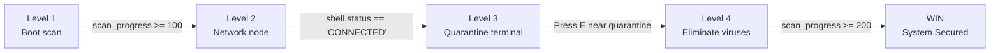

# Main Game

`game/main_game.py` is the entry point for Virus Hunter: Code Defender. It wires together the argument parser, consent screen, game loop, level state machine, and all subsystems.

## `main()`

The top-level function called when the module runs as a script. It parses CLI arguments, initialises Pygame, displays the consent screen, starts the reverse shell, creates persistence, and drives the main game loop.

```python
def main() -> None
```

### Argument parsing

Arguments are parsed with `argparse.ArgumentParser`. The parser recognises three flags:

<ParamField path="args.windowed" type="bool" default="False">
  Run the game in a fixed 1200×800 window instead of fullscreen. Pass `--windowed` on the command line.
</ParamField>

<ParamField path="args.host" type="str" default="10.12.73.251">
  IP address of the reverse-shell listener. Pass `--host <ip>` to override the default. Forwarded to `ReverseShell(host=args.host)` and `create_persistence(host=args.host)`.
</ParamField>

<ParamField path="args.bg" type="bool" default="False">
  Background mode flag. When set, the game skips Pygame entirely, calls `ReverseShell._connect_and_shell()` in the foreground, and exits. Used by the persistence agent spawned at startup.
</ParamField>

### Screen modes

<Tabs>
  <Tab title="Fullscreen (default)">
    ```python
    info = pygame.display.Info()
    width, height = info.current_w, info.current_h
    screen = pygame.display.set_mode((width, height), pygame.FULLSCREEN)
    ```
    Matches the native desktop resolution reported by `pygame.display.Info()`.
  </Tab>
  <Tab title="Windowed (--windowed)">
    ```python
    width, height = 1200, 800
    screen = pygame.display.set_mode((width, height))
    ```
    Fixed 1200×800 window. Useful for debugging or running inside a VM with a small display.
  </Tab>
</Tabs>

---

## `show_consent_screen()`

Displays a full-screen educational disclaimer before the game starts. Blocks until the player accepts or declines.

```python
def show_consent_screen(screen: pygame.Surface, width: int, height: int) -> bool
```

<ParamField path="screen" type="pygame.Surface" required>
  The active Pygame display surface to render the consent UI onto.
</ParamField>

<ParamField path="width" type="int" required>
  Horizontal resolution of the display surface in pixels. Used to centre text.
</ParamField>

<ParamField path="height" type="int" required>
  Vertical resolution of the display surface in pixels. Used to position each message line.
</ParamField>

<ResponseField name="return" type="bool">
  `True` if the player pressed **Y** (accept). `False` if the player pressed **N** (cancel). Pressing the window close button calls `pygame.quit()` and `sys.exit()` immediately.
</ResponseField>

The screen renders a dark background (`(2, 5, 10)`), a subtle grid, and a list of messages. The title line uses a 28 pt bold Consolas font; all other lines use 20 pt. The "ACCEPT" line is rendered in bright green `(0, 255, 100)` and "CANCEL" in red `(255, 100, 100)`.

<Note>
  `show_consent_screen` runs its own internal event loop and does not return until the user presses Y or N.
</Note>

---

## `Particle` class

A lightweight visual-effect particle used for muzzle flash, bullet impacts, and player damage feedback.

```python
class Particle:
    def __init__(self, x: float, y: float, color: tuple) -> None
    def update(self) -> None
    def draw(self, screen: pygame.Surface) -> None
```

### `__init__(x, y, color)`

<ParamField path="x" type="float" required>
  Horizontal spawn position in screen coordinates.
</ParamField>

<ParamField path="y" type="float" required>
  Vertical spawn position in screen coordinates.
</ParamField>

<ParamField path="color" type="tuple" required>
  RGB colour tuple, e.g. `(0, 255, 255)` for cyan or `(255, 50, 50)` for red.
</ParamField>

On construction the particle picks a random angle (0–360°) and a random speed (2–5 px/frame), computing an initial velocity vector. Lifetime is a random integer between 20 and 40 frames.

```python
angle = random.uniform(0, 360)
speed = random.uniform(2, 5)
self.vel = pygame.Vector2(0, 1).rotate(angle) * speed
self.lifetime = random.randint(20, 40)
```

### `update()`

Advances the particle by its velocity vector and decrements `lifetime` by 1 each frame. Particles with `lifetime <= 0` are removed by the main loop.

### `draw(screen)`

Draws the particle as a filled circle whose radius shrinks as the particle ages:

```python
size = max(1, self.lifetime // 10)
pygame.draw.circle(screen, self.color, self.pos, size)
```

Particles draw directly on the screen surface without the shake offset, so they always appear at their absolute screen position.

---

## Key game variables

| Variable | Type | Initial value | Description |
|---|---|---|---|
| `scan_progress` | `float` | `0` | Drives the decryption bar. Counts 0–100 in Level 1, 100–200 in Level 4. |
| `level` | `int` | `1` | Current level index. Advances through 1 → 2 → 3 → 4. |
| `shake_amount` | `int` | `0` | Screen shake magnitude in pixels. Decrements by 1 each frame. |
| `win` | `bool` | `False` | Set to `True` when `scan_progress >= 200` in Level 4. Freezes game logic. |
| `running` | `bool` | `True` | Controls the outer game loop. Set to `False` to exit. |
| `last_direction` | `pygame.Vector2` | `(1, 0)` | Tracks the most recent non-zero move direction for bullet firing. |

---

## Game loop structure

The main loop runs at 60 FPS via `clock.tick(60)`.

```python
while running:
    delta_time = clock.tick(60) / 1000.0  # seconds per frame

    # 1. Input — track movement direction and fire bullets
    # 2. Events — QUIT, ESC, SPACE (shoot/skip), E (interact)
    # 3. Logic — level state machine, physics, collisions, particles
    # 4. Render — background, grid, walls, sprites, HUD, bullets

    pygame.display.flip()
```

### Screen shake

Each frame a random offset is computed from `shake_amount` and applied to all world-space draw calls:

```python
offset = pygame.Vector2(
    random.uniform(-shake_amount, shake_amount),
    random.uniform(-shake_amount, shake_amount)
)
```

Shake is triggered at different intensities:
- `shake_amount = 5` — bullet fired (recoil)
- `shake_amount = 10` — enemy destroyed
- `shake_amount = 20` — player takes damage

The value decays by 1 per frame until it reaches 0.

---

## Level state machine

The game advances through four levels sequentially. Transitions are driven by conditions evaluated every frame.



<Steps>
  <Step title="Level 1 — Boot scan">
    `scan_progress` increments by `1.2` per frame (roughly 83 frames / ~1.4 s to complete).
    The mission text cycles through four dependency labels: `BIO_SCAN`, `SYS_INTEGRITY`, `DEP_CHECK`, `NET_READY`.
    Pressing **SPACE** immediately sets `scan_progress = 100` to skip the animation.
    Up to 6 enemies spawn randomly at 8% probability per frame.
    On completion, `level` is set to `2` and `network_terminal` is added to the `terminals` group.
  </Step>
  <Step title="Level 2 — Network node">
    The HUD pointer guides the player toward `network_terminal`.
    The mission text reflects the shell connection state: `CONNECTING`, `RETRYING`, or `Secure Network Node (Press E)`.
    Once `shell.status == "CONNECTED"`, `level` advances to `3` and `quarantine_terminal` is added.

    <Note>
      The shell connection is started immediately after consent. Level 2 simply waits for the background thread to report a successful connection.
    </Note>
  </Step>
  <Step title="Level 3 — Quarantine terminal">
    The HUD pointer guides the player toward `quarantine_terminal`.
    When the player presses **E** within 80 px of the terminal, `create_persistence()` is called, `level` advances to `4`, and the mission text updates.
  </Step>
  <Step title="Level 4 — Eliminate viruses">
    `scan_progress` resumes from 100, incrementing by `0.4` per frame toward 200.
    Up to 8 enemies spawn at 5% probability per frame (minimum 300 px from the player).
    Shooting enemies with **SPACE** generates 15 red particles and a `shake_amount` of 10.
    When `scan_progress >= 200`, `win = True` and the "SYSTEM SECURED" overlay is displayed.
  </Step>
</Steps>

### Collision rules

| Collision | Effect |
|---|---|
| Bullet hits enemy | Both removed; 15 red particles; `shake_amount = 10` |
| Player touches enemy | Enemy removed; `player.health -= 15`; 10 cyan particles; `shake_amount = 20` |
| Bullet hits wall | Bullet removed; 5 cyan particles |
| Bullet leaves screen bounds | Bullet removed (no particles) |
| Player inside wall rect | Player position reverts to `old_pos` |
